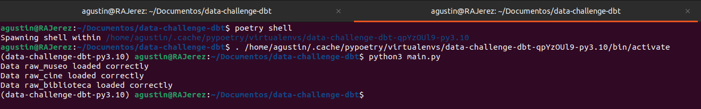
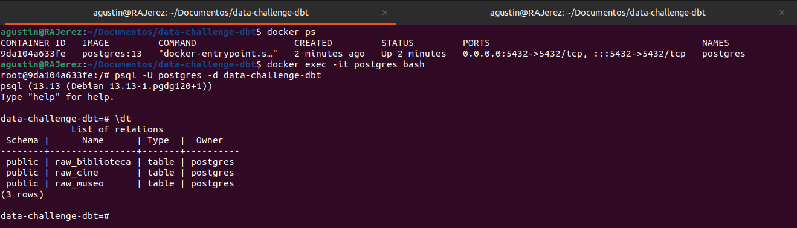
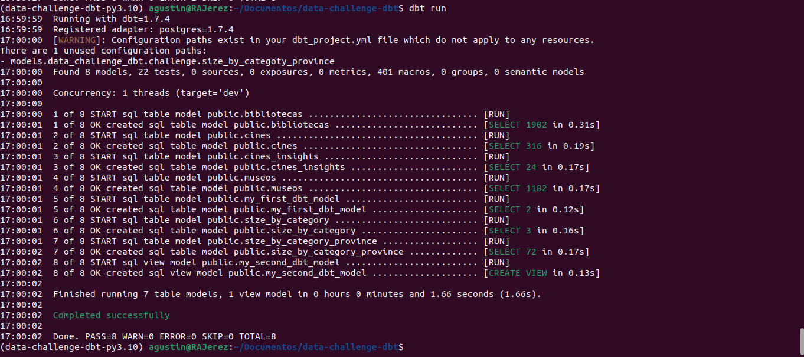
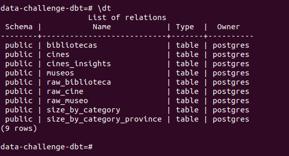
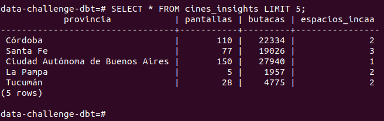

# Data Challenge - DBT

This project aims to process data for a data challenge, utilizing DBT models. The data will be sourced from three tables containing raw information about libraries, museums, and cinemas in Argentina, stored in a PostgreSQL database.

## Data processing
Data processing involves transforming the raw data into structured information that will populate the database. This includes:

1. Normalizing information from museums, cinemas, and libraries to generate tables with the following columns:
    - 'cod_localidad'
    - 'id_provincia'
    - 'id_departamento'
    - 'categoría'
    - 'provincia'
    - 'localidad'
    - 'nombre'
    - 'domicilio'
    - 'código postal'
    - 'número de teléfono'
    - 'mail'
    - 'web'

2. Processing joint data to generate a table with the following information:
    - Total number of records per category
    - Total number of records per source
    - Number of records per province and category

3. Processing cinema information to create a table containing:
    - 'Provincia'
    - 'Cantidad de pantallas' (Number of screens)
    - 'Cantidad de butacas' (Number of seats)
    - 'Cantidad de espacios' INCAA (Number of INCAA spaces)

## Prerequisites

Ensure the following dependencies are installed:

- python==3.10
- docker==25.0.12
- dbt-postgres==1.7.4
- poetry==1.7.1

#### Using Poetry
If you prefer using Poetry for dependency management:

Install poetry from pipx and the installation will be carried out isolated from the global environment
    
    pipx install poetry==1.7.1
    poetry install
    poetry shell

#### Without Poetry
If you do not use Poetry, install dependencies via requirements.txt:

    python3 -m virtualenv venv
    source venv/bin/activate
    pip install -r 'requirements.txt'

## Database configuration and data ingestion
> [!TIP]
> set your PostgreSQL environment variables in a `.env`

1. Build a container with PostgreSQL :

    sudo docker compose up -d

2. Load raw data into the database using the following script:

    python3 main.py

You can access the database from bash:

    docker exec -it postgres psql -U postgres -d data-challenge-dbt

## Running DBT models:

    dbt run

> [!TIP]
> Check that the tables were created correctly in the database.

## Database Queries

Make queries to the database to check

